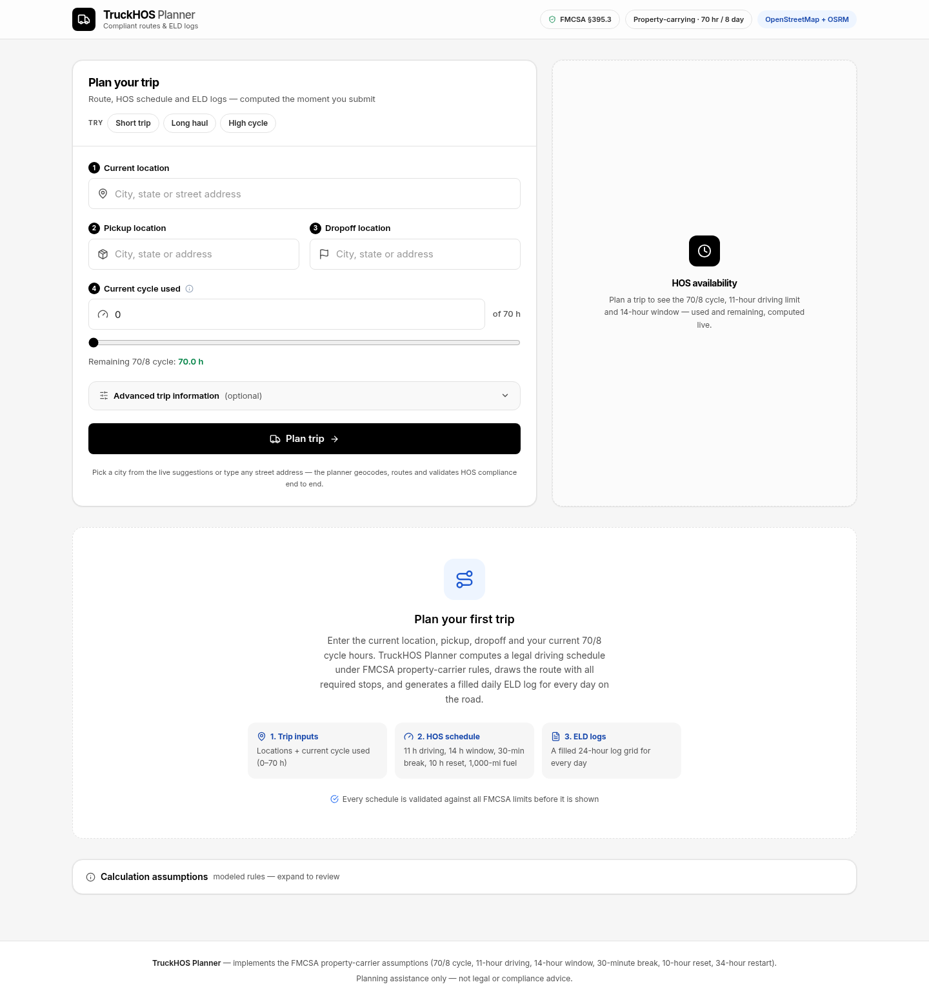
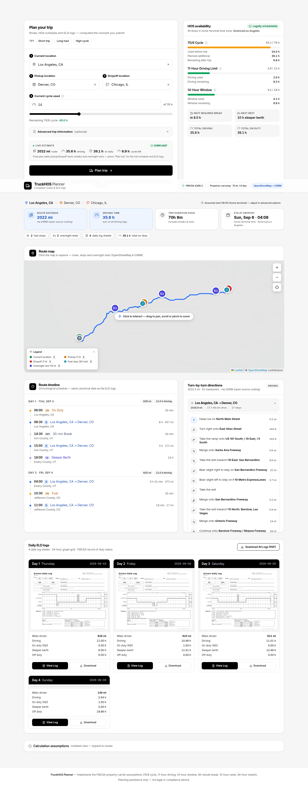
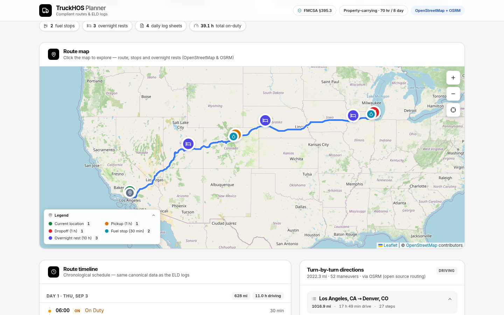
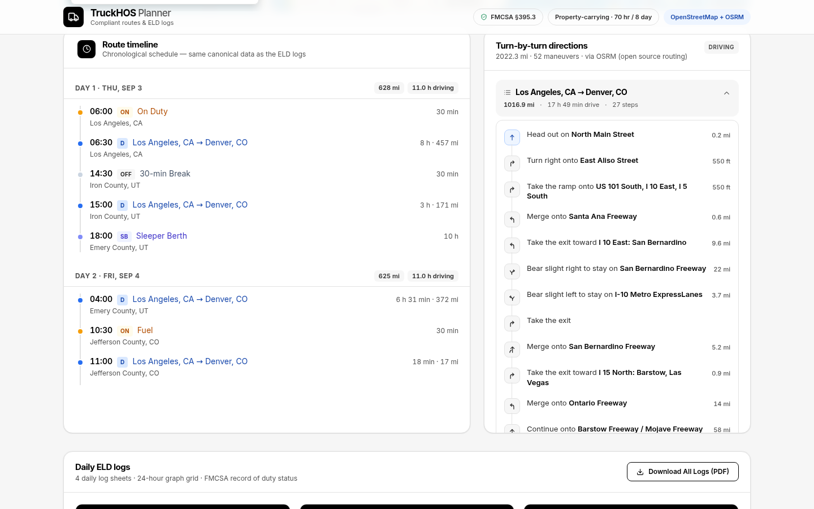
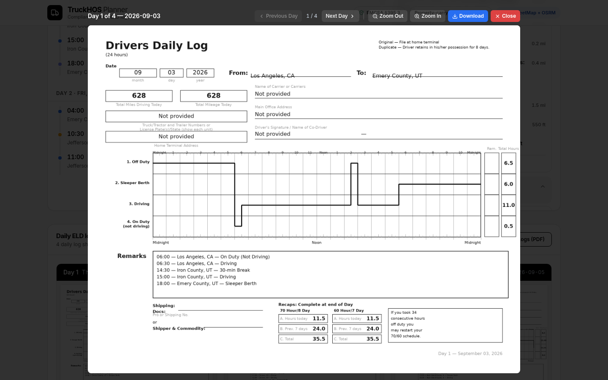
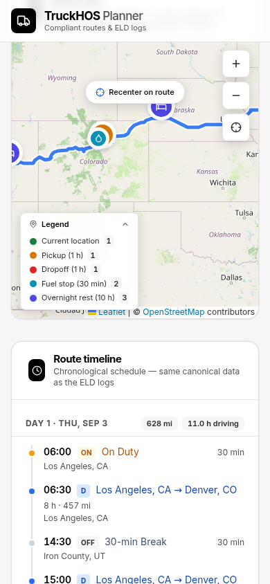

<div align="center">

# 🛣️ TruckHOS Planner

### Full-Stack Truck HOS Trip Planner & ELD Log Generator

**Plan truck trips, schedule HOS activities, visualize routes, and generate filled daily ELD driver logs.**

React + TypeScript · Django + Django REST Framework · OpenStreetMap · OSRM

[](#-testing)
[](#-testing)
[](https://www.typescriptlang.org/)
[](https://react.dev/)
[](https://www.djangoproject.com/)
[](#-license)

<br />

### 🚀 [Live Demo](https://truck-hos-planner-spotter.vercel.app)

### 🎥 [Loom Demo & Code Walkthrough](https://www.loom.com/share/32b0f454478b4c7ca1680c4e3a777263)

</div>

---

## ⚠️ Disclaimer

This application implements the assumptions specified in the Spotter Full Stack Developer assessment brief.

It is a demonstration and planning project and is:

- Not legal or compliance advice
- Not a certified ELD
- Not intended to replace official FMCSA guidance or a certified electronic logging device

---

# 📌 Overview

TruckHOS Planner is a full-stack application for planning long-haul truck trips under specified Hours of Service (HOS) assumptions.

The application accepts four required inputs:

1. Current Location
2. Pickup Location
3. Dropoff Location
4. Current Cycle Used

It then generates:

- 🗺️ A route with planned HOS stops
- ⏱️ A chronological driver activity timeline
- 📊 HOS availability and utilization
- 🧭 Turn-by-turn route instructions
- 📝 Filled daily Drivers Daily Log sheets
- 📄 A combined PDF containing the generated daily logs

The core architectural principle is a **single canonical activity timeline**.

The route map, HOS summary, timeline, route instructions, and ELD logs all consume the same generated schedule so that different parts of the application do not independently calculate conflicting trip information.

---

# 🎥 Demo

## 🚀 Live Application

https://truck-hos-planner-spotter.vercel.app

## 🎬 Loom Demo & Code Walkthrough

https://www.loom.com/share/32b0f454478b4c7ca1680c4e3a777263

The walkthrough demonstrates:

- Trip planning
- Live location autocomplete
- Current cycle input
- Live trip estimation
- HOS scheduling
- Route visualization
- HOS availability
- Chronological activity timeline
- Turn-by-turn directions
- Filled daily ELD logs
- PDF export
- Backend architecture
- HOS scheduler implementation
- Automated tests
- Deployment

---

# 📸 Screenshots

| Trip Planner | Results Overview |
|---|---|
|  |  |
| Real-time location selectors, cycle input and live estimate | Trip summary, HOS availability, route and ETA |

| Route Map | Turn-by-Turn Directions |
|---|---|
|  |  |
| Planned fuel, break, rest and trip stops | OSRM-powered maneuver-aware navigation |

| ELD Log Viewer | Responsive Mobile UI |
|---|---|
|  |  |
| Filled daily driver log sheet | Responsive interface on a 390px mobile viewport |

---

# ✨ Features

## 🚛 Trip Planning

### Real-Time Location Search

- US-focused location search
- Nominatim geocoding
- Live autocomplete suggestions
- Debounced requests
- Race-safe suggestion handling
- Popular freight hubs on focus
- Exact-address fallback

### Live Trip Estimate

Before submitting a trip, the application provides a dry-run estimate including:

- Route distance
- Estimated driving time
- Duty-window usage
- Remaining 70/8 cycle
- HOS review status

### Trip Configuration

Required inputs:

- Current location
- Pickup location
- Dropoff location
- Current cycle used

Optional advanced information:

- Driver name
- Carrier
- Truck number
- Trailer number
- Main office
- Start date
- Start time
- Home-terminal timezone

---

# 🗺️ Route & Scheduling

## Interactive Route Map

The route is rendered using:

- Leaflet
- OpenStreetMap tiles
- OSRM route geometry

The map displays planned activities such as:

- Current location
- Pickup
- Dropoff
- Fuel stops
- 30-minute breaks
- 10-hour rest periods
- 34-hour restarts

Each planned stop can expose:

- Arrival time
- Departure time
- Duration
- Stop type

The map supports:

- Pan
- Scroll/pinch zoom
- Keyboard interaction
- Route recentering

---

# 🧭 Turn-by-Turn Directions

Route instructions are generated from OSRM maneuver information.

The UI renders:

- Maneuver type
- Direction modifier
- Road name
- Driver-friendly distance
- Per-leg distance
- Per-leg driving time
- Step count

Example instructions:

- Turn right onto East Aliso Street
- Take the exit toward I 10 East
- Take the 2nd exit at the roundabout

---

# ⏱️ Chronological Activity Timeline

The application generates a chronological activity timeline containing the driver's planned activities.

Activities can include:

- On Duty
- Driving
- Fuel
- Break
- Pickup
- Dropoff
- Rest
- 34-hour Restart

The timeline is generated from the same canonical schedule used by the route map, HOS summary, and ELD logs.

---

# 📊 HOS Availability

The HOS panel displays the driver's availability across:

- 70-hour / 8-day cycle
- 11-hour driving limit
- 14-hour duty window

It also provides:

- Next required break
- Next required rest
- Current totals
- Cycle utilization

The values are calculated from the generated HOS schedule rather than using an independent frontend calculation.

---

# 📝 Daily ELD Logs

The application generates filled Drivers Daily Log sheets for each calendar day.

Each daily log contains:

- Duty-status graph
- Off Duty
- Sleeper Berth
- Driving
- On Duty Not Driving
- Daily totals
- Remarks
- Shipping information
- 70/8 cycle recap

For multi-day trips, the application automatically generates one log sheet per calendar day.

Generated logs can be:

- Previewed inline
- Opened in a zoomable viewer
- Downloaded as individual PNG images
- Exported as one combined PDF

Each day's four duty-status totals are validated to equal exactly:

**24 hours / 1,440 minutes**

---

# 🧮 HOS Scheduling Logic

The scheduling engine implements the assumptions specified in the assessment brief for a property-carrying driver operating under a 70-hour / 8-day cycle with no adverse driving conditions.

## HOS Rules

| Rule | Value |
|---|---|
| Driving limit | 11 hours |
| Driving window | 14 consecutive hours |
| Required break | 30 minutes after 8 cumulative driving hours |
| Daily reset | 10 consecutive hours |
| Cycle | 70 hours / 8 days |
| Restart | 34 consecutive hours |

The engine independently tracks:

- 11-hour driving limit
- 14-hour duty window
- 70-hour / 8-day cycle
- Driving time since the last required break
- Distance since the last fueling stop

---

# ⚙️ Deterministic Scheduling

The HOS scheduler follows a deterministic priority order.

At each scheduling step:

1. **70/8 cycle exhausted**
   - Schedule a 34-hour restart or return an infeasible result.

2. **11-hour driving or 14-hour window exhausted**
   - Schedule a 10-hour reset.

3. **8 cumulative driving hours reached**
   - Schedule a 30-minute break.

4. **1,000 miles since last fuel**
   - Schedule a 30-minute fuel stop.

5. **Otherwise**
   - Drive the largest legal slice.

Additional scheduling assumptions include:

- Pickup duration is 1 hour.
- Dropoff duration is 1 hour.
- Pickup and dropoff are on-duty not driving.
- Pickup and dropoff consume the duty window and cycle but not the 11-hour driving allowance.
- Qualifying non-driving periods can satisfy the required 30-minute break.
- All scheduled times use the home-terminal timezone.
- Duty-status changes generate remarks.
- Each daily log is validated to exactly 1,440 minutes.

---

# 🧱 Architecture

```text
React + TypeScript
        │
        │ REST / JSON
        ▼
Django + Django REST Framework
        │
        ├── routing/
        │     ├── Nominatim geocoding
        │     ├── OSRM routing
        │     └── Turn-by-turn instruction builder
        │
        ├── hos/
        │     ├── constants
        │     ├── state
        │     ├── scheduler
        │     └── validators
        │
        ├── trips/
        │     ├── models
        │     ├── serializers
        │     ├── views
        │     └── service orchestration
        │
        └── eldlogs/
              ├── log template
              ├── Pillow renderer
              └── PDF export
```

---

# ⭐ Single Source of Truth

The most important architectural decision is the **canonical activity timeline**.

```text
Trip Inputs
     │
     ▼
Geocoding
     │
     ▼
Route per Leg
     │
     ▼
HOS Scheduler
     │
     ▼
CANONICAL ACTIVITY TIMELINE
     │
     ├── Route Map
     ├── Turn-by-Turn Instructions
     ├── HOS Summary
     ├── Chronological Timeline
     └── Daily ELD Logs
```

Every major output reads from the same scheduled activity list.

This prevents separate calculations for the map, timeline, HOS panel, and daily logs from becoming inconsistent.

---

# 🛠️ Technology Stack

| Layer | Technology |
|---|---|
| Frontend | React 18 + TypeScript |
| Build Tool | Vite |
| Styling | Tailwind CSS |
| Data Fetching | TanStack Query |
| Mapping | Leaflet |
| Backend | Django |
| API | Django REST Framework |
| Routing | OSRM |
| Geocoding | Nominatim |
| Log Rendering | Pillow |
| PDF Generation | ReportLab |
| Backend Testing | pytest / pytest-django |
| Frontend Testing | Vitest + Testing Library |
| Development Database | SQLite |
| Production Database | PostgreSQL |
| Production Server | Gunicorn |
| Static Files | WhiteNoise |
| Frontend Deployment | Vercel |
| Backend Deployment | Render |

---

# 📡 API Documentation

| Method | Endpoint | Description |
|---|---|---|
| POST | `/api/trips/plan/` | Full planning pipeline: geocode → route → schedule → validate → render logs |
| POST | `/api/trips/validate/` | Dry-run HOS feasibility validation |
| GET | `/api/trips/{id}/` | Stored trip details |
| GET | `/api/trips/{id}/route/` | Route geometry and turn-by-turn information |
| GET | `/api/trips/{id}/logs/` | All daily logs |
| GET | `/api/trips/{id}/logs/{day}/` | Individual daily log |
| GET | `/api/trips/{id}/logs/{day}/image/` | Rendered daily log PNG |
| GET | `/api/trips/{id}/logs/pdf/` | Combined trip PDF |
| GET | `/api/geocode/suggest/?q=...` | Live US location suggestions |
| GET | `/api/geocode/?q=...` | Geocoding helper |
| GET | `/api/health/` | Health and HOS configuration information |

---

# 📦 Example API Request

```json
{
  "current_location": "Chicago, IL",
  "pickup_location": "Indianapolis, IN",
  "dropoff_location": "Columbus, OH",
  "current_cycle_used": 32,
  "driver_name": "John Doe",
  "carrier_name": "ACME Freight LLC",
  "truck_number": "123",
  "trailer_number": "456"
}
```

---

# ❌ Error Handling

The API returns structured and user-friendly errors instead of exposing raw backend tracebacks.

Example:

```json
{
  "error": "Pickup location could not be found. Try adding the city and state.",
  "code": "address-not-found"
}
```

The application distinguishes between:

- `400` — Invalid request or address
- `422` — HOS-infeasible trip
- `503` — Map service unavailable

The frontend maps API error codes to user-friendly messages and retry paths.

---

# 🧪 Testing

The project includes automated testing across both backend and frontend.

## Backend — 80 Tests

Backend tests cover:

### HOS Engine

`test_hos_engine.py`

- Assessment scenarios
- Edge cases
- Zero-length legs
- Same-location trips
- Cycle boundary cases
- Midnight crossings
- Validator behavior

### Invariants

`test_invariants.py`

- Chronological ordering
- No gaps
- No overlaps
- Daily totals equal 1,440 minutes
- 11-hour driving limit
- 14-hour duty window
- 8-hour break rule
- 70-hour cycle
- Fuel threshold
- Daily miles versus route miles

### API

`test_api.py`

- API contracts
- Mocked routing and geocoding
- Multi-day trips
- Error responses

### Route Instructions

`test_router_instructions.py`

- Maneuver-aware phrasing
- Instruction payloads
- Navigation formatting

### Location Suggestions

`test_suggest.py`

- Suggestion shaping
- Deduplication
- Cache behavior
- Upstream failure handling

---

# 🧪 Frontend — 37 Tests

Frontend tests use:

- Vitest
- Testing Library

Coverage includes:

- Form behavior
- Request payloads
- Live suggestions
- Live estimate
- Route instructions
- Distance formatting
- Maneuver icon mapping
- Application state
- Error mapping

---

# ▶️ Run Tests

## Backend

```bash
cd backend
./venv/bin/python -m pytest tests/ -v
```

Expected:

```text
80 passed
```

## Frontend

```bash
cd frontend
bun run test
```

Expected:

```text
37 passed
```

---

# 🚀 Local Development

## 1. Clone the Repository

```bash
git clone https://github.com/0ye0m/Truck-HOS-Planner-Spotter.git
cd Truck-HOS-Planner-Spotter
```

## 2. Backend Setup

```bash
cd backend

python -m venv venv
```

### Linux / macOS

```bash
source venv/bin/activate
```

### Windows

```powershell
venv\Scripts\activate
```

Install dependencies:

```bash
pip install -r requirements.txt
```

Create environment configuration:

```bash
cp .env.example .env
```

Run migrations:

```bash
python manage.py migrate
```

Start Django:

```bash
python manage.py runserver 0.0.0.0:8000
```

## 3. Frontend Setup

Open another terminal:

```bash
cd frontend

bun install
```

Or:

```bash
npm install
```

Create environment configuration:

```bash
cp .env.example .env
```

Start Vite:

```bash
bun run dev
```

Or:

```bash
npm run dev
```

Open:

```text
http://localhost:3000
```

---

# 🧪 Built-In QA Scenarios

The planner includes deterministic example trips for quick testing.

## Short Trip

```text
Chicago
   ↓
Indianapolis
   ↓
Columbus

Cycle: 32 hours
```

## Long Haul

```text
Los Angeles
   ↓
Denver
   ↓
Chicago

Cycle: 24 hours
```

## High Cycle

```text
Dallas
   ↓
Memphis
   ↓
Atlanta

Cycle: 63 hours
```

These scenarios are useful for testing:

- Short trips
- Multi-day trips
- HOS constraints
- Rest scheduling
- Cycle utilization
- Daily ELD generation

---

# ☁️ Deployment

## Frontend — Vercel

The production frontend is deployed on Vercel:

### https://truck-hos-planner-spotter.vercel.app

The frontend communicates with the Django backend through the configured API rewrite/proxy.

## Backend

The backend supports deployment through:

- Render
- Docker Compose
- Python/Gunicorn-compatible hosting platforms

Production database support is provided through PostgreSQL using:

```text
DATABASE_URL
```

---

# 🐳 Docker Deployment

The repository includes Docker configuration for running the application as a production-style stack.

```bash
DJANGO_SECRET_KEY=$(python -c "import secrets;print(secrets.token_urlsafe(50))") \
docker compose up --build
```

The frontend is served through nginx and proxies:

```text
/api
/media
```

to the Django backend.

---

# 📁 Project Structure

```text
Truck-HOS-Planner-Spotter/
│
├── backend/
│   ├── config/
│   │   ├── settings
│   │   ├── urls
│   │   └── wsgi
│   │
│   ├── hos/
│   │   ├── constants
│   │   ├── state
│   │   ├── scheduler
│   │   └── validators
│   │
│   ├── routing/
│   │   ├── geocoder
│   │   ├── suggestions
│   │   ├── OSRM router
│   │   └── instruction builder
│   │
│   ├── eldlogs/
│   │   ├── log templates
│   │   ├── Pillow renderer
│   │   └── PDF generation
│   │
│   ├── trips/
│   │   ├── models
│   │   ├── serializers
│   │   ├── views
│   │   └── service orchestration
│   │
│   ├── tests/
│   │   └── 80 backend tests
│   │
│   ├── Dockerfile
│   └── requirements.txt
│
├── frontend/
│   ├── src/
│   │   ├── features/
│   │   │   ├── trip-planner
│   │   │   ├── route-map
│   │   │   ├── timeline
│   │   │   ├── hos-summary
│   │   │   └── eld-logs
│   │   │
│   │   ├── components/
│   │   │   ├── LocationInput
│   │   │   ├── RouteInstructions
│   │   │   └── ...
│   │   │
│   │   ├── services/
│   │   │   └── API client
│   │   │
│   │   └── types/
│   │       └── TypeScript contracts
│   │
│   ├── Dockerfile
│   ├── nginx.conf
│   └── package.json
│
├── docs/
│   └── screenshots/
│
├── docker-compose.yml
├── render.yaml
├── vercel.json
├── netlify.toml
└── README.md
```

---

# 📋 Assumptions

The planner follows the assumptions specified for the assessment:

- Property-carrying driver
- 70-hour / 8-day cycle
- No adverse driving conditions
- No short-haul exception
- 30-minute fuel stop
- Fueling at least once every 1,000 miles
- 1-hour pickup
- 1-hour dropoff
- 30-minute pre-trip on-duty period
- 06:00 assumed departure when a start time is not provided
- Home-terminal timezone used for trip scheduling

The HOS constants and rules are isolated so additional rule sets can be added later.

---

# ⚠️ Known Limitations

## HOS Scope

The current implementation does not use sleeper-berth split provisions such as 7/3 or 8/2.

The scheduler uses the specified simple 10-hour reset assumption.

## 70/8 Historical Data

The 70/8 recap uses the supplied current-cycle value together with the trip's own scheduled activities.

Historical day-by-day cycle data beyond the supplied current-cycle input is therefore an approximation.

## Route Data

Route information is provided by OSRM.

If the upstream routing service is unavailable, the application returns a friendly retry/error response instead of fabricating route data.

## Stop Labels

Planned stop labels are generated from available geocoding/reverse-geocoding information.

When a real business name cannot be resolved, the application uses explicit labels such as:

- Planned fuel stop
- Planned rest stop

Business names are not fabricated.

## Rendered Media

On some free-tier deployments, generated ELD media may reside on ephemeral instance storage.

If that storage is cleared after a deployment, the application can request the trip to be planned again to regenerate the log files.

---

# 🔐 Design & Engineering Principles

## Deterministic Core Logic

The HOS engine is isolated from Django and external network services, making the core scheduling behavior deterministic and testable.

## Single Source of Truth

The canonical activity timeline drives every major output.

## Explicit Rules

HOS decisions are represented explicitly rather than being hidden inside UI logic.

## Validation Before Serving

Generated schedules are validated before being returned as valid trip plans.

## Structured Errors

The API returns structured error codes and user-friendly messages.

## Testability

The HOS engine is isolated so scheduling behavior can be tested independently.

## Free Mapping Stack

The application uses the OpenStreetMap ecosystem with Nominatim and OSRM instead of requiring a paid mapping provider.

---

# 🔮 Future Improvements

Potential extensions include:

- Authentication and user accounts
- Persistent trip history
- Multiple driver support
- Fleet management
- Additional HOS rule configurations
- Sleeper-berth split support
- Additional jurisdiction/rule profiles
- Persistent object storage for generated logs
- Background route-planning jobs
- Production-grade routing infrastructure
- Advanced dispatch and fleet workflows

---

# 📜 License

This project is licensed under the MIT License.

See [LICENSE](LICENSE) for details.

---

# 👨‍💻 Author

**Om Pramod Mandwade**

B.Tech — Information Technology

Shri Ramdeobaba College of Engineering and Management, Nagpur

---

<div align="center">

# 🚛 TruckHOS Planner

**Route → HOS Schedule → Activity Timeline → ELD Logs**

### 🚀 [Live Demo](https://truck-hos-planner-spotter.vercel.app)

### 🎥 [Watch the Loom Demo](https://www.loom.com/share/32b0f454478b4c7ca1680c4e3a777263)

</div>
